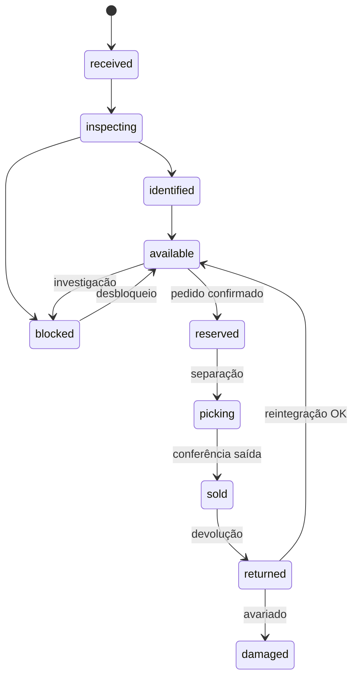

# Especificação Técnica — Módulo de Estoque

**Versão:** 1.0  
**Depende de:** [Regras Globais](../regras-globais.md)  
**Stack:** Go + PostgreSQL

---

## 1. Responsabilidades

O módulo de estoque é o **motor transacional central**. Responsável por:

- Rastrear cada **unidade física** individualmente
- Manter saldos por SKU/depósito derivados de **movimentações imutáveis**
- Gerenciar **reservas** vinculadas a pedidos
- Controlar **transições de status** com máquina de estados
- Executar **inventários** e **ajustes auditados**
- Detectar **inconsistências** (itens fantasmas)
- Emitir **eventos** para vendas, financeiro, CRM, e-commerce, Compras Paraguai
- Expor **API de consulta de disponibilidade** (fonte única de verdade)

**Princípio inviolável:** nenhum código fora deste módulo altera saldo ou status de unidade diretamente.

---

## 2. Modelo de domínio

```
┌─────────────┐     ┌─────────────┐     ┌──────────────────┐
│  Warehouse  │────<│  Location   │────<│ InventoryUnit    │
└─────────────┘     └─────────────┘     └────────┬─────────┘
                                                  │
┌─────────────┐     ┌─────────────┐              │
│    SKU      │────<│  Product    │              │
└──────┬──────┘     └─────────────┘              │
       │                                          │
       │         ┌──────────────────┐             │
       └────────>│ StockBalance     │             │
                 │ (materialized)   │             │
                 └──────────────────┘             │
                                                  │
       ┌──────────────────────────────────────────┤
       │                                          │
┌──────▼──────┐  ┌──────────────┐  ┌─────────────▼────┐
│  Movement   │  │ Reservation  │  │  StockCount      │
│ (immutable) │  │              │  │  + CountLine     │
└─────────────┘  └──────────────┘  └──────────────────┘
```

### 2.1 Entidades principais

| Entidade | Descrição |
|----------|-----------|
| `warehouses` | Depósitos (filiais físicas) |
| `locations` | Endereço interno hierárquico (área/estante/prateleira/posição) |
| `inventory_units` | Unidade física individual (código AAA0001) |
| `stock_movements` | Registro imutável de toda alteração |
| `stock_reservations` | Reserva ativa vinculada a pedido |
| `stock_balances` | View/materialização: físico, reservado, disponível por SKU/depósito |
| `stock_counts` | Sessão de inventário |
| `stock_count_lines` | Linha de contagem (unidade ou qty) |
| `stock_adjustments` | Solicitação de ajuste com workflow de aprovação |
| `stock_health_issues` | Inconsistência detectada |

---

## 3. Schema PostgreSQL

```sql
-- Extensões
CREATE EXTENSION IF NOT EXISTS "uuid-ossp";
CREATE EXTENSION IF NOT EXISTS "pg_trgm";

-- Depósitos
CREATE TABLE warehouses (
    id          UUID PRIMARY KEY DEFAULT uuid_generate_v4(),
    code        VARCHAR(20) NOT NULL UNIQUE,
    name        VARCHAR(100) NOT NULL,
    branch_id   UUID,  -- FK organizations.branches (Etapa 3)
    is_active   BOOLEAN NOT NULL DEFAULT true,
    created_at  TIMESTAMPTZ NOT NULL DEFAULT now(),
    updated_at  TIMESTAMPTZ NOT NULL DEFAULT now()
);

-- Localizações (materialized path: DEP01-A-03-02)
CREATE TABLE locations (
    id           UUID PRIMARY KEY DEFAULT uuid_generate_v4(),
    warehouse_id UUID NOT NULL REFERENCES warehouses(id),
    code         VARCHAR(50) NOT NULL,
    aisle        VARCHAR(10),
    rack         VARCHAR(10),
    shelf        VARCHAR(10),
    position     VARCHAR(10),
    is_active    BOOLEAN NOT NULL DEFAULT true,
    UNIQUE (warehouse_id, code)
);

-- Unidade física
CREATE TYPE unit_status AS ENUM (
    'received',           -- Recebida
    'inspecting',         -- Em conferência
    'identified',         -- Identificada (código gerado)
    'available',          -- Disponível para venda
    'reserved',           -- Reservada (pedido)
    'picking',            -- Em separação
    'sold',               -- Vendida (baixa definitiva)
    'in_transit',         -- Em trânsito (transferência/expedição)
    'returned',           -- Devolvida (aguardando inspeção)
    'warranty',           -- Em garantia
    'rma',                -- Em RMA fornecedor
    'damaged',            -- Avariada
    'blocked',            -- Bloqueada (investigação)
    'written_off'         -- Baixada (perda definitiva)
);

CREATE TABLE inventory_units (
    id              UUID PRIMARY KEY DEFAULT uuid_generate_v4(),
    public_code     VARCHAR(20) NOT NULL UNIQUE,  -- AAA0001
    sku_id          UUID NOT NULL,                -- FK products.skus
    warehouse_id    UUID NOT NULL REFERENCES warehouses(id),
    location_id     UUID REFERENCES locations(id),
    status          unit_status NOT NULL DEFAULT 'received',
    purchase_id     UUID,                         -- FK purchases (origem)
    unit_cost_usd   NUMERIC(12,2),
    received_at     TIMESTAMPTZ,
    available_at    TIMESTAMPTZ,
    sold_at         TIMESTAMPTZ,
    order_id        UUID,                         -- FK orders (quando vendida)
    order_item_id   UUID,
    reservation_id  UUID,
    serial_number   VARCHAR(100),                 -- serial do fabricante (opcional)
    notes           TEXT,
    version         INT NOT NULL DEFAULT 1,       -- optimistic locking
    created_at      TIMESTAMPTZ NOT NULL DEFAULT now(),
    updated_at      TIMESTAMPTZ NOT NULL DEFAULT now()
);

CREATE INDEX idx_units_sku_status ON inventory_units (sku_id, status);
CREATE INDEX idx_units_warehouse_status ON inventory_units (warehouse_id, status);
CREATE INDEX idx_units_location ON inventory_units (location_id) WHERE location_id IS NOT NULL;
CREATE INDEX idx_units_public_code_trgm ON inventory_units USING gin (public_code gin_trgm_ops);

-- Sequência para código público
CREATE SEQUENCE inventory_unit_code_seq START 1;

-- Tipos de movimentação
CREATE TYPE movement_type AS ENUM (
    'purchase_in',        -- Entrada por compra
    'return_in',          -- Devolução cliente
    'transfer_in',        -- Transferência recebida
    'adjustment_in',      -- Ajuste positivo
    'sale_out',           -- Saída por venda
    'transfer_out',       -- Transferência enviada
    'supplier_return',    -- Devolução ao fornecedor
    'damage_out',         -- Avaria/perda
    'adjustment_out',     -- Ajuste negativo
    'reserve',            -- Reserva (lógica, não altera físico)
    'release',            -- Liberação de reserva
    'status_change',      -- Mudança de status sem qty
    'reversal'            -- Estorno de movimentação anterior
);

CREATE TABLE stock_movements (
    id                UUID PRIMARY KEY DEFAULT uuid_generate_v4(),
    movement_type     movement_type NOT NULL,
    sku_id            UUID NOT NULL,
    warehouse_id      UUID NOT NULL REFERENCES warehouses(id),
    inventory_unit_id UUID REFERENCES inventory_units(id),
    quantity          INT NOT NULL DEFAULT 1,  -- +1 entrada, -1 saída
    unit_status_before unit_status,
    unit_status_after  unit_status,
    reference_type    VARCHAR(50),   -- 'order', 'purchase', 'adjustment', 'count', 'transfer'
    reference_id      UUID,
    reason            TEXT,
    notes             TEXT,
    created_by        UUID NOT NULL,   -- FK users
    approved_by       UUID,
    reversed_by_movement_id UUID REFERENCES stock_movements(id),
    idempotency_key   VARCHAR(100) UNIQUE,
    created_at        TIMESTAMPTZ NOT NULL DEFAULT now()
    -- SEM updated_at — imutável
);

CREATE INDEX idx_movements_sku_wh ON stock_movements (sku_id, warehouse_id, created_at);
CREATE INDEX idx_movements_unit ON stock_movements (inventory_unit_id);
CREATE INDEX idx_movements_reference ON stock_movements (reference_type, reference_id);

-- Reservas
CREATE TYPE reservation_status AS ENUM (
    'active', 'fulfilled', 'released', 'expired'
);

CREATE TABLE stock_reservations (
    id              UUID PRIMARY KEY DEFAULT uuid_generate_v4(),
    order_id        UUID NOT NULL,
    order_item_id   UUID NOT NULL,
    sku_id          UUID NOT NULL,
    warehouse_id    UUID NOT NULL REFERENCES warehouses(id),
    inventory_unit_id UUID REFERENCES inventory_units(id),  -- null = reserva por qty
    quantity        INT NOT NULL DEFAULT 1,
    status          reservation_status NOT NULL DEFAULT 'active',
    expires_at      TIMESTAMPTZ NOT NULL,
    created_at      TIMESTAMPTZ NOT NULL DEFAULT now(),
    released_at     TIMESTAMPTZ,
    fulfilled_at    TIMESTAMPTZ
);

CREATE INDEX idx_reservations_active ON stock_reservations (sku_id, warehouse_id)
    WHERE status = 'active';
CREATE INDEX idx_reservations_order ON stock_reservations (order_id);
CREATE INDEX idx_reservations_expires ON stock_reservations (expires_at)
    WHERE status = 'active';

-- Saldo materializado (atualizado via triggers ou transação)
CREATE TABLE stock_balances (
    sku_id          UUID NOT NULL,
    warehouse_id    UUID NOT NULL REFERENCES warehouses(id),
    qty_physical    INT NOT NULL DEFAULT 0,
    qty_reserved    INT NOT NULL DEFAULT 0,
    qty_available   INT GENERATED ALWAYS AS (qty_physical - qty_reserved) STORED,
    updated_at      TIMESTAMPTZ NOT NULL DEFAULT now(),
    PRIMARY KEY (sku_id, warehouse_id),
    CONSTRAINT chk_physical_non_negative CHECK (qty_physical >= 0),
    CONSTRAINT chk_reserved_non_negative CHECK (qty_reserved >= 0),
    CONSTRAINT chk_reserved_lte_physical CHECK (qty_reserved <= qty_physical)
);

-- Inventário
CREATE TYPE count_status AS ENUM (
    'draft', 'in_progress', 'pending_review', 'approved', 'cancelled'
);

CREATE TABLE stock_counts (
    id              UUID PRIMARY KEY DEFAULT uuid_generate_v4(),
    warehouse_id    UUID NOT NULL REFERENCES warehouses(id),
    count_type      VARCHAR(30) NOT NULL,  -- 'full', 'partial', 'cycle', 'location', 'category'
    filter_json     JSONB,                 -- critérios de escopo
    status          count_status NOT NULL DEFAULT 'draft',
    started_at      TIMESTAMPTZ,
    completed_at    TIMESTAMPTZ,
    created_by      UUID NOT NULL,
    approved_by     UUID,
    created_at      TIMESTAMPTZ NOT NULL DEFAULT now()
);

CREATE TABLE stock_count_lines (
    id                  UUID PRIMARY KEY DEFAULT uuid_generate_v4(),
    stock_count_id      UUID NOT NULL REFERENCES stock_counts(id),
    inventory_unit_id   UUID REFERENCES inventory_units(id),
    sku_id              UUID,
    location_id         UUID REFERENCES locations(id),
    system_qty          INT NOT NULL DEFAULT 0,
    counted_qty         INT,
    variance            INT GENERATED ALWAYS AS (COALESCE(counted_qty, 0) - system_qty) STORED,
    recount_qty         INT,
    status              VARCHAR(20) DEFAULT 'pending',  -- pending, counted, recounted, resolved
    notes               TEXT
);

-- Ajustes com aprovação
CREATE TYPE adjustment_status AS ENUM (
    'pending', 'approved', 'rejected', 'applied', 'cancelled'
);

CREATE TABLE stock_adjustments (
    id              UUID PRIMARY KEY DEFAULT uuid_generate_v4(),
    warehouse_id    UUID NOT NULL REFERENCES warehouses(id),
    sku_id          UUID,
    inventory_unit_id UUID,
    quantity_delta  INT NOT NULL,          -- +/- 
    estimated_value_usd NUMERIC(12,2),
    reason          TEXT NOT NULL,
    status          adjustment_status NOT NULL DEFAULT 'pending',
    stock_count_id  UUID REFERENCES stock_counts(id),
    requested_by    UUID NOT NULL,
    approved_by     UUID,
    second_approved_by UUID,
    applied_movement_id UUID REFERENCES stock_movements(id),
    created_at      TIMESTAMPTZ NOT NULL DEFAULT now()
);

-- Saúde do estoque / inconsistências
CREATE TYPE health_issue_type AS ENUM (
    'sold_but_available',
    'duplicate_code',
    'reservation_orphan',
    'negative_balance',
    'missing_location',
    'status_mismatch',
    'ghost_system',
    'ghost_physical'
);

CREATE TYPE health_issue_status AS ENUM ('open', 'investigating', 'resolved', 'ignored');

CREATE TABLE stock_health_issues (
    id                  UUID PRIMARY KEY DEFAULT uuid_generate_v4(),
    issue_type          health_issue_type NOT NULL,
    status              health_issue_status NOT NULL DEFAULT 'open',
    inventory_unit_id   UUID REFERENCES inventory_units(id),
    sku_id              UUID,
    warehouse_id        UUID REFERENCES warehouses(id),
    details             JSONB NOT NULL,
    detected_at         TIMESTAMPTZ NOT NULL DEFAULT now(),
    resolved_at         TIMESTAMPTZ,
    resolved_by         UUID,
    resolution_notes    TEXT
);

CREATE INDEX idx_health_open ON stock_health_issues (status, issue_type)
    WHERE status = 'open';
```

---

## 4. Máquina de estados — unidade física

### 4.1 Status que contam como "físico disponível"

`available`, `reserved`, `picking`

### 4.2 Transições permitidas

| De | Para | Gatilho | Permissão |
|----|------|---------|-----------|
| `received` | `inspecting` | Iniciar conferência | `inventory.inspect` |
| `inspecting` | `identified` | Conferência OK | `inventory.inspect` |
| `inspecting` | `blocked` | Problema detectado | `inventory.inspect` |
| `identified` | `available` | Etiquetado + localizado | `inventory.release` |
| `available` | `reserved` | Reserva de pedido | sistema (via reserva) |
| `reserved` | `picking` | Iniciar separação | `inventory.pick` |
| `picking` | `sold` | Conferência saída | `inventory.ship` |
| `available` | `blocked` | Bloqueio manual | `inventory.block` |
| `blocked` | `available` | Desbloqueio | `inventory.block` |
| `blocked` | `damaged` | Diagnóstico | `inventory.inspect` |
| `blocked` | `rma` | Enviar RMA | `inventory.rma` |
| `sold` | `returned` | Devolução cliente | `inventory.return` |
| `returned` | `inspecting` | Iniciar conferência devolução | `inventory.inspect` |
| `returned` | `available` | Reintegração OK | `inventory.release` |
| `returned` | `damaged` | Item avariado | `inventory.inspect` |
| `returned` | `rma` | Enviar RMA | `inventory.rma` |
| `available` | `in_transit` | Transferência saída | `inventory.transfer` |
| `in_transit` | `available` | Transferência entrada | `inventory.transfer` |
| `*` | `written_off` | Baixa definitiva | `inventory.write_off` + aprovação |

Transições não listadas: **negadas** unless `inventory.override_status` (Admin Geral, auditado).

### 4.3 Diagrama principal (venda)



---

## 5. Movimentações

### 5.1 Regras

1. Toda alteração de qty ou status gera `stock_movements` na **mesma transação**
2. Movimentos **nunca são deletados** — estorno via `reversal` com referência ao original
3. `idempotency_key` obrigatório em operações de API (header `Idempotency-Key`)
4. `stock_balances` atualizado na mesma transação (não eventual)

### 5.2 Atualização de saldo

```go
// Pseudocódigo — toda operação dentro de tx
func applyMovement(tx, movement) {
    insert(stock_movements, movement)
    
    switch movement.type {
    case purchase_in, return_in, adjustment_in:
        upsertBalance(sku, warehouse, physical += qty)
    case sale_out, adjustment_out, damage_out:
        upsertBalance(sku, warehouse, physical -= qty)
    case reserve:
        upsertBalance(sku, warehouse, reserved += qty)
    case release:
        upsertBalance(sku, warehouse, reserved -= qty)
    }
    
    if movement.inventory_unit_id != nil {
        updateUnitStatus(movement.unit_id, movement.status_after, version)
    }
    
    insertOutboxEvent(tx, deriveEvent(movement))
}
```

---

## 6. Reservas

### 6.1 Criar reserva (pedido confirmado)

```
POST /internal/stock/reservations
{
  "order_id": "...",
  "items": [
    { "order_item_id": "...", "sku_id": "...", "warehouse_id": "...", "quantity": 2 }
  ],
  "expires_at": "..."  // calculado pelas regras globais
}
```

**Algoritmo:**

1. Lock `stock_balances` row (`SELECT ... FOR UPDATE`)
2. Verificar `qty_available >= quantity`
3. Selecionar unidades FIFO (`available_at ASC`) se rastreio por unidade
4. Para cada unidade: transição `available → reserved`, movement `reserve`
5. Criar `stock_reservations` com `expires_at`
6. Atualizar `qty_reserved` no balance
7. Emitir `stock.reserved`

**Falha:** retorna 409 `INSUFFICIENT_STOCK` com detalhe por SKU.

### 6.2 Liberar reserva (cancelamento)

- Movement `release`, status unidade `reserved → available`
- Reservation `status → released`

### 6.3 Fulfillment (baixa)

- Separação: `reserved → picking`
- Conferência saída: `picking → sold`, movement `sale_out`
- Reservation `status → fulfilled`
- Decrementa `qty_physical` e `qty_reserved`

### 6.4 Expiração (job)

```
Cron: every 5 minutes
  SELECT * FROM stock_reservations WHERE status = 'active' AND expires_at < now()
  FOR EACH: release + emit stock.reservation_expired + notify vendas
```

---

## 7. API REST

Base: `/api/v1/stock`

### 7.1 Consulta (qualquer módulo)

| Método | Endpoint | Descrição |
|--------|----------|-----------|
| GET | `/availability?sku_id=&warehouse_id=` | `{ physical, reserved, available }` |
| GET | `/availability/bulk` | POST body com lista de SKUs |
| GET | `/units/{public_code}` | Detalhe unidade + histórico movimentos |
| GET | `/units?sku_id=&status=&location_id=` | Listagem paginada |
| GET | `/balances?warehouse_id=` | Saldos por depósito |

### 7.2 Operações (módulo estoque)

| Método | Endpoint | Descrição |
|--------|----------|-----------|
| POST | `/receive` | Recebimento de compra (cria unidades) |
| POST | `/units/{id}/inspect` | Avançar conferência |
| POST | `/units/{id}/locate` | Atribuir localização |
| POST | `/units/{id}/release` | Tornar disponível |
| POST | `/units/{id}/block` | Bloquear |
| POST | `/units/{id}/unblock` | Desbloquear |
| POST | `/pick` | Iniciar separação (lista de unidades) |
| POST | `/ship` | Baixa definitiva pós-conferência |
| POST | `/transfer` | Transferência entre depósitos |
| POST | `/adjustments` | Solicitar ajuste |
| POST | `/adjustments/{id}/approve` | Aprovar ajuste |
| POST | `/adjustments/{id}/apply` | Aplicar ajuste aprovado |

### 7.3 Inventário

| Método | Endpoint | Descrição |
|--------|----------|-----------|
| POST | `/counts` | Criar sessão de inventário |
| POST | `/counts/{id}/start` | Iniciar contagem |
| POST | `/counts/{id}/lines` | Registrar contagem (scan) |
| POST | `/counts/{id}/complete` | Finalizar contagem |
| POST | `/counts/{id}/approve` | Aprovar e gerar ajustes |

### 7.4 Saúde

| Método | Endpoint | Descrição |
|--------|----------|-----------|
| GET | `/health` | Dashboard saúde (KPIs) |
| GET | `/health/issues` | Listar inconsistências |
| POST | `/health/issues/{id}/resolve` | Resolver inconsistência |
| POST | `/health/scan` | Disparar scan manual |

### 7.5 Interno (service-to-service)

| Método | Endpoint | Consumidor |
|--------|----------|------------|
| POST | `/internal/reservations` | Vendas/E-commerce |
| DELETE | `/internal/reservations/{order_id}` | Vendas (cancelamento) |
| POST | `/internal/reservations/{order_id}/fulfill` | Logística |

Autenticação interna: service token + mTLS `[fase 2]`.

---

## 8. Eventos (outbox)

| Evento | Payload mínimo | Consumidores |
|--------|----------------|--------------|
| `stock.unit.created` | unit_id, sku_id, warehouse_id | PIM, auditoria |
| `stock.unit.available` | unit_id, sku_id | Integrações, Compras PY |
| `stock.available_changed` | sku_id, warehouse_id, available | E-commerce, Compras PY, cache |
| `stock.reserved` | order_id, items[] | CRM, notificações |
| `stock.reservation_released` | order_id, reason | Vendas |
| `stock.reservation_expired` | order_id, items[] | Vendas, notificações |
| `stock.shipped` | order_id, units[] | Financeiro, logística, CRM |
| `stock.returned` | order_id, unit_id, condition | Financeiro, CRM |
| `stock.adjusted` | adjustment_id, sku_id, delta | Financeiro, auditoria |
| `stock.health_issue_detected` | issue_id, type | Admin, alertas |

Padrão outbox:

```sql
CREATE TABLE outbox_events (
    id          UUID PRIMARY KEY DEFAULT uuid_generate_v4(),
    event_type  VARCHAR(100) NOT NULL,
    payload     JSONB NOT NULL,
    created_at  TIMESTAMPTZ NOT NULL DEFAULT now(),
    published_at TIMESTAMPTZ
);
```

Worker Go poll → publish → mark `published_at`.

---

## 9. Motor de regras

Centralizado em `internal/stock/rules/` — **único lugar** com lógica de validação.

```go
type RuleContext struct {
    Unit       *InventoryUnit
    Balance    *StockBalance
    Movement   MovementType
    User       *User
    Reference  Reference
}

// Exemplos
func RuleUnitMustBeAvailable(ctx RuleContext) error
func RuleSufficientStock(ctx RuleContext) error
func RuleAdjustmentRequiresReason(ctx RuleContext) error
func RuleAdjustmentRequiresApproval(ctx RuleContext) error
func RuleTransitionAllowed(ctx RuleContext) error
func RuleReservationNotExpired(ctx RuleContext) error
```

Chamado antes de toda operação. Retorno: `ErrRuleViolation` com código legível.

---

## 10. Inventário — fluxo detalhado

```
1. CREATE count (draft) — define escopo (depósito, categorias, localização)
2. START → status in_progress, snapshot system_qty por unidade/SKU no escopo
3. COUNT lines — operador scaneia códigos ou informa qty
4. COMPLETE → calcula variances, status pending_review
5. Se variance != 0:
   a. Sugere recontagem
   b. Após 2ª contagem, exige investigação se persistir
6. APPROVE → gera stock_adjustments automáticos por variance
7. APPLY adjustments → movimentações + auditoria
```

---

## 11. Geração de código público

Formato: `AAA` + sequência 4 dígitos mínimo (expande: AAA10000).

```sql
CREATE OR REPLACE FUNCTION generate_unit_public_code()
RETURNS VARCHAR AS $$
DECLARE
    seq_val BIGINT;
BEGIN
    seq_val := nextval('inventory_unit_code_seq');
    RETURN 'AAA' || LPAD(seq_val::TEXT, 4, '0');
END;
$$ LANGUAGE plpgsql;
```

Código imutável após criação. Unicidade enforced por UNIQUE constraint.

---

## 12. Job de saúde (detecção de fantasmas)

Executado **diariamente** + sob demanda:

```sql
-- Vendida mas ainda disponível
INSERT INTO stock_health_issues (issue_type, inventory_unit_id, details)
SELECT 'sold_but_available', id, jsonb_build_object('status', status)
FROM inventory_units
WHERE status = 'available' AND sold_at IS NOT NULL;

-- Reserva órfã
SELECT 'reservation_orphan', r.id, ...
FROM stock_reservations r
LEFT JOIN orders o ON o.id = r.order_id
WHERE r.status = 'active' AND (o.id IS NULL OR o.status IN ('cancelled'));

-- Saldo negativo (constraint impede, mas detecta tentativas)
-- Serial duplicado
SELECT 'duplicate_code', ...
FROM inventory_units
GROUP BY public_code HAVING COUNT(*) > 1;
```

---

## 13. Concorrência e integridade

| Mecanismo | Uso |
|-----------|-----|
| `SELECT FOR UPDATE` | Balance row durante reserva/baixa |
| Optimistic locking (`version`) | Update de unidade física |
| `idempotency_key` | API de movimentação |
| CHECK constraints | Saldos non-negative, reserved ≤ physical |
| UNIQUE | public_code, idempotency_key |
| Transação única | Movement + balance + unit status + outbox |
| Imutabilidade | stock_movements sem UPDATE/DELETE |

---

## 14. Estrutura de código Go (proposta)

```
internal/
  stock/
    domain/
      unit.go
      movement.go
      reservation.go
      balance.go
    repository/
      postgres/
    service/
      receive.go
      reserve.go
      ship.go
      adjust.go
      count.go
      health.go
    rules/
      engine.go
      transitions.go
    handler/
      api.go
    events/
      publisher.go
    jobs/
      expire_reservations.go
      health_scan.go
```

---

## 15. Cenários de teste obrigatórios

| # | Cenário | Resultado esperado |
|---|---------|-------------------|
| T1 | Reserva com estoque suficiente | available↓, reserved↑, units reserved |
| T2 | Reserva com estoque insuficiente | 409, nenhuma alteração |
| T3 | Duas reservas concorrentes último item | Uma OK, uma 409 (FOR UPDATE) |
| T4 | Cancelamento libera reserva | available restaurado |
| T5 | Ship baixa definitiva | sold, physical↓, reserved↓ |
| T6 | Expiração de reserva | released, notify |
| T7 | Ajuste positivo com aprovação | movement + balance |
| T8 | Ajuste negativo sem justificativa | 422 |
| T9 | Ajuste > USD 2000 | exige dupla aprovação |
| T10 | Transição de status inválida | 422 RuleViolation |
| T11 | Reversal de movimento | movimento inverso, saldo restaurado |
| T12 | Inventário com divergência | adjustment gerado após approve |
| T13 | Idempotency key duplicada | retorna resultado original |
| T14 | Devolução reintegra unidade | returned → available |
| T15 | Health scan detecta sold_but_available | issue criada |

---

## 16. Critérios de aceite — MVP Estoque

- [ ] Recebimento de compra cria unidades com código único
- [ ] Fluxo completo received → available funcional
- [ ] Reserva/liberação/fulfillment integrado com pedidos
- [ ] Saldos physical/reserved/available corretos em concorrência
- [ ] Movimentações imutáveis com auditoria
- [ ] Inventário parcial com ajuste auditado
- [ ] Job de expiração de reservas
- [ ] Job de saúde detecta inconsistências básicas
- [ ] API de disponibilidade respondendo < 100ms p95
- [ ] Eventos outbox publicados para available_changed e shipped
- [ ] 15 cenários de teste passando

---

## 17. Dependências de outros módulos

| Módulo | Dependência | Fase |
|--------|-------------|------|
| Produtos/SKU | `sku_id` FK | Antes do estoque |
| Compras | `purchase_id` na entrada | Paralelo |
| Usuários/Permissões | auth + RBAC | Antes |
| Vendas | API reserva/fulfill | Depois do MVP estoque |
| Financeiro | evento `stock.shipped` | Depois |

---

## Próximo passo de implementação

1. Criar migrations PostgreSQL (schema desta spec)
2. Implementar `domain` + `repository` + `rules/transitions`
3. Implementar fluxo receive → available (T1-T4)
4. Implementar reserva/ship (T1-T6)
5. Jobs de expiração e saúde
6. API REST + testes de integração
